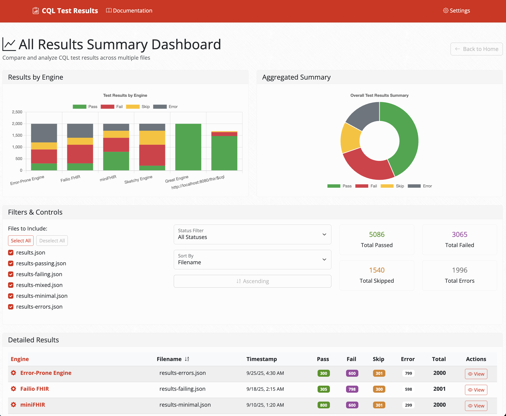
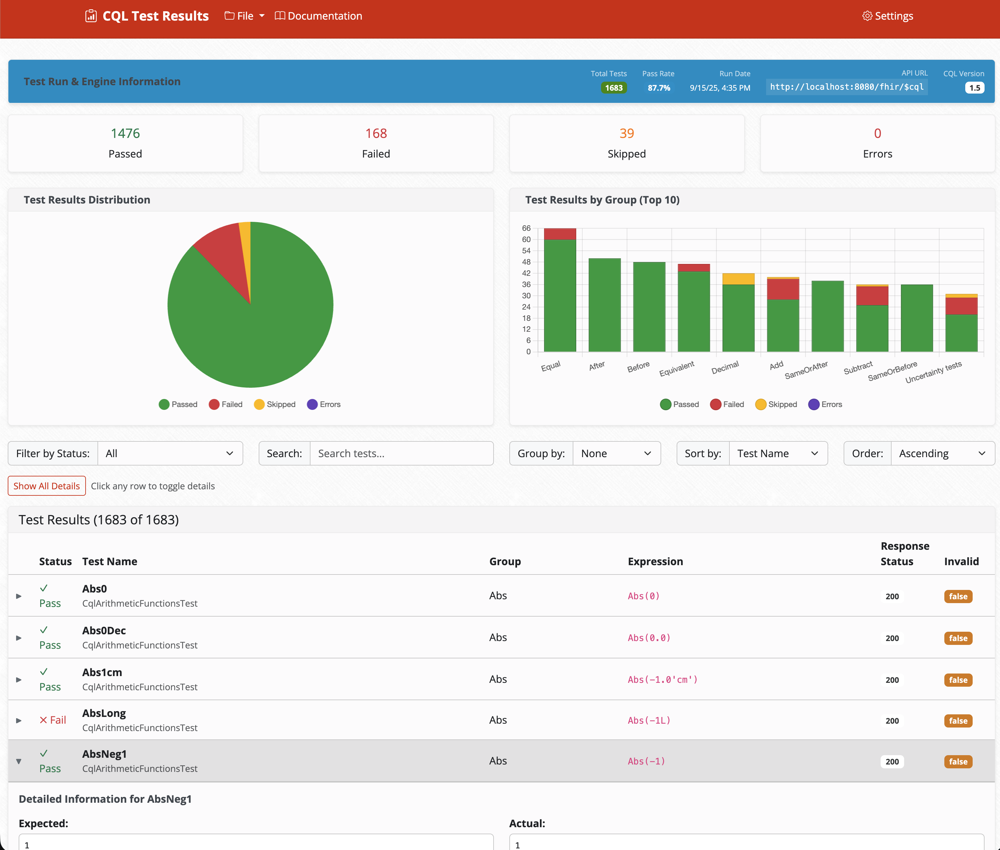
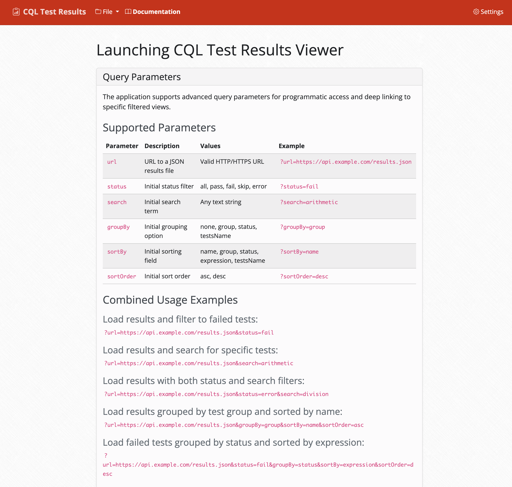

# CQL Studio

A web application for viewing and analyzing CQL (Clinical Quality Language) test results created from [CQL Tests Runner](https://github.com/cqframework/cql-tests-runner/issues/40).

#### Cross-Engine Comparison Summary


#### In-Depth Result Review


#### Numerous Data Loading Options 


#### Loading w/Deep-Linking Documentation


## Quick Start with Docker

The easiest way to run this application is using Docker:

### Build and Run with Docker

```bash
# Build the Docker image
docker build -t hlseven/quality-cql-tests-ui:latest .

# Alternatively, build images for multiple architectures if supported by your build environment
docker buildx build --platform linux/arm64,linux/amd64 -t hlseven/quality-cql-tests-ui:latest .

# Run the container
docker run -p 4200:80 hlseven/quality-cql-tests-ui
```

Once the container is running, open your browser and navigate to `http://localhost:4200/`.


## Running from Source Code

### Prerequisites

- Current stable version of Node.js
- npm (comes with Node.js)

### Development Server

To start a local development server, run:

```bash
# Install dependencies
npm install

# Start the development server
npm run start
```

## Docker Details

This application uses a multi-stage Docker build:

1. **Builder Stage**: Uses Node.js 24 Alpine to install dependencies and build the Angular application
2. **Runtime Stage**: Uses Nginx Alpine to serve the built application

The Docker setup includes:
- `Dockerfile`: Multi-stage build configuration
- `nginx.conf`: Nginx configuration for serving the Angular app
- `entrypoint.sh`: Runtime configuration script

### Docker Environment Variables

The application supports runtime configuration through environment variables. The `entrypoint.sh` script processes `configuration.template.js` to generate the final configuration at runtime.

#### Available Environment Variables

- **CQL_STUDIO_RUNNER_BASE_URL**: Specifies the base URL for the CQL Tests Runner service. This URL is used to communicate with the runner backend for executing CQL tests and retrieving results. Defaults to `http://localhost:3000`.

- **CQL_STUDIO_FHIR_BASE_URL**: Specifies the base URL for the FHIR server. This URL is used for FHIR resource operations and data retrieval. Defaults to `http://localhost:8080/fhir`.

- **CQL_STUDIO_TRANSLATION_BASE_URL**: Specifies the base URL for the translation service. This URL is used for CQL translation and conversion operations. Defaults to `http://localhost:3001`.

## Adding New CQL Versions

To add support for a new CQL version:

1. **Add version type** in `src/app/services/cql-grammar-manager.service.ts`:
   ```typescript
   export type CqlVersion = '1.5.3' | '2.0.0-ballot' | 'new-version';
   ```

2. **Add grammar definition** to `GRAMMAR_REGISTRY`:
   ```typescript
   'new-version': {
     version: 'new-version',
     keywords: ['new', 'keyword'],
     functions: ['NewFunction'],
     dataTypes: ['NewType'],
     operators: ['+', '-', '*', '/', '=', '<>', '!=', '<', '>', '<=', '>=', 'and', 'or', 'not', 'xor', 'implies'],
     patterns: { /* copy from existing version */ }
   }
   ```

3. **Update UI** in `src/app/components/cql-with-fhir/cql-with-fhir.component.html`:
   ```html
   <option value="new-version">CQL new-version</option>
   ```

4. **Set as default** (optional): Update default values in grammar manager, CQL editor, and CQL with FHIR components. Default is currently CQL 1.5.3.

The system automatically handles version-specific syntax highlighting, autocomplete, and validation.

## Attribution & License

Copyright © 2025 Preston Lee. All rights reserved. Provided under the Apache 2.0 license.
